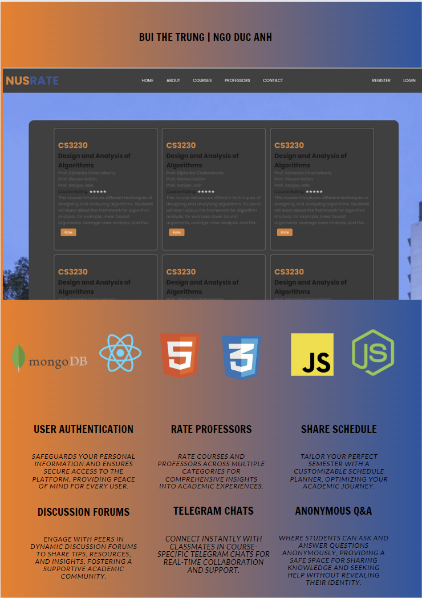

# Milestone 1

# NUSRate

NUSRate is a website designed to allow users to rate courses and professors at the National University of Singapore (NUS). It provides a platform for students to share their experiences, opinions, and feedback anonymously about various courses and professors, helping other students make decisions when selecting their courses.

# Milestone 1

## Motivation

After an academic year with the trouble of finding reviews about our necessary modules, struggling to assess professors' teaching quality, and facing difficulties in setting up an academic plan, we were motivated to enhance the academic journey for students at the National University of Singapore (NUS). We aimed to create a platform tailored to their unique needs, enabling them to share and access evaluations of professors and courses easily. By incorporating user authentication to ensure trustworthiness and a feature for personalized schedule recommendations to aid in academic planning, our goal is to empower students with the tools they need to make informed decisions, improve their educational experience, and foster a supportive, engaged academic community.

## User Stories

In the envisioned system, students are empowered to navigate their academic journey with greater insight and personalization. They will be able to delve into detailed reviews and ratings of professors and courses, enabling informed decision-making tailored to individual learning preferences and goals. Beyond consuming content, students can contribute their own experiences, rating educational aspects like clarity and engagement to aid their peers. The system offers a personalized schedule recommendation tool where students input preferences to generate optimal academic schedules, further enhancing this by sharing and soliciting feedback on these schedules within the community. Secure user authentication ensures a personalized and safe experience, encouraging a vibrant exchange of knowledge. Students can also compare courses and professors through filters, engage in discussions, and connect over shared academic interests, creating a collaborative and informed community eager to support each other’s academic success.

## Core Features

1. **User Authentication**: Ensure secure access to the platform and personalized user experiences.
2. **Rate Professors and Courses**: Allow users to rate professors and courses based on different weighted categories.
3. **Share Self-customized Recommended Schedule**: Enable users to share their recommended schedules based on personal preferences.

## Additional Features (Extensions)

4. **Detailed Course Ratings**: Provide more detailed ratings for courses, such as workload, difficulty, and usefulness.
5. **Course Telegram Chat**: Facilitate real-time discussions among students taking the same course.
6. **Anonymous Q&A**: Allow users to ask questions anonymously and receive answers from the community.

## Usage

1. **Register:** New users can create an account by filling out the registration form with their NUS email.
2. **Login:** Registered users can log in to their accounts using their username/email and password.
3. **Browse Courses and Professors:** Users can navigate through the website to explore different courses and professors.
4. **Rate Courses and Professors:** Users can rate and review courses and professors based on their experiences.
5. **Search Functionality:** Users can use the search bar to search for specific courses or professors by name.
6. **Navigation:** Users can use the navigation bar to easily switch between different sections of the website.

## Technologies Used

- **Frontend:**

  - React: JavaScript library for building user interfaces.
  - Bootstrap: Frontend framework for designing responsive and mobile-first websites.
  - HTML/CSS: Markup and styling languages for structuring and styling web pages.
  - JavaScript: Programming language used for interactivity and functionality.

- **Backend:**
  - Node.js: JavaScript runtime environment for running server-side code.
  - Express: Web framework for Node.js.
  - MongoDB: NoSQL database for storing user accounts, course information, and ratings.

## Contributors

- Bui The Trung (TrungBui32)
- Ngo Duc Anh (NikiNgoDa_NUSCS)

